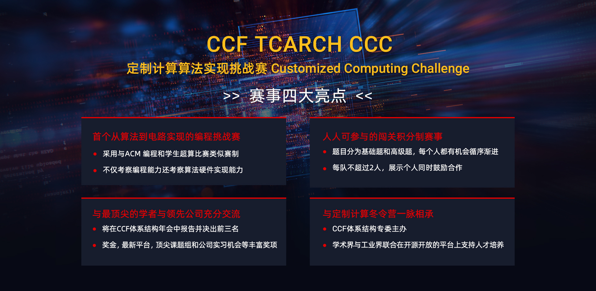

# 竞赛介绍

CCF TCARCH- 计算机体系结构挑战赛是中国计算机学会体系结构专委会所举办的旨在挖掘计算机体系结构人才、激发学生对计算机体系结构的研究兴趣、培养学生创新精神的一项全国赛事。

Customized Computing Challeng (CCC 定制计算算法实现挑战赛) 由CCF 体系结构专委主办，北京大学CECA和Xilinx学术合作部联合承办，是首次发起的基于HLS的算法到硬件实现编程挑战赛，不仅考察编程能力还考察算法硬件实现能力。比赛采用与ACM编程和学生超算比赛类似赛制，题目分初级、高级，闯关制积分，循序渐进，每队不超过2人，展示个人同时鼓励合作。

本次比赛提供参与世界顶尖的学者和领先公司充分交流的机会。同时提供丰厚奖金、丰富的实验平台，以及参与到北大研究院，Xilinx以及其他企业的实习机会。这是继定制计算冬令营后的又一特色活动，体现学术界与工业界联合在开源开放的平台上支持人才培养。