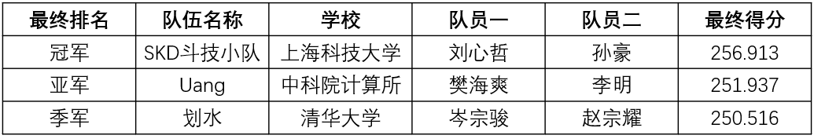
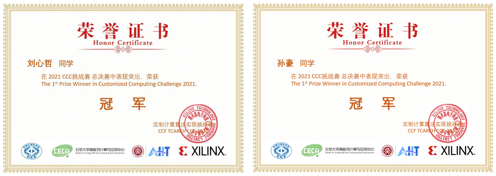
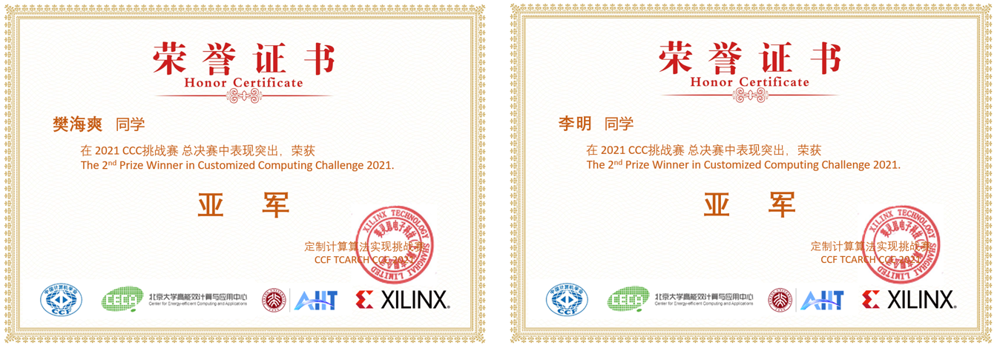
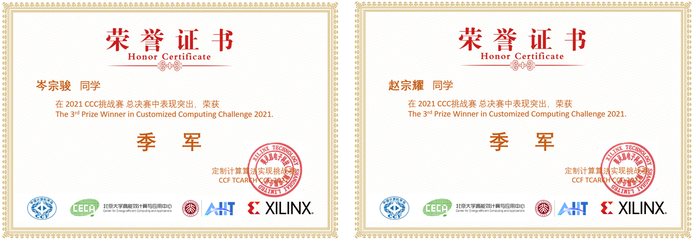

# CCC2021最终排名 

## 往届风采

<!-- [基于ZYNQ FPGA的高精度双目光学定位导航系统](https://www.bilibili.com/video/BV1Ni4y127nY?spm_id_from=333.337.search-card.all.click)

[ThunderRiNG](https://www.bilibili.com/video/BV1Ab4y1t7ZK?spm_id_from=333.337.search-card.all.click)

[基于数据流的目标探测网络加速器](https://www.bilibili.com/video/BV14L411K7i3?spm_id_from=333.337.search-card.all.click)

[基于RISC-V的积木式可拼接图形化编程系统](https://www.bilibili.com/video/BV1tL411K77a?spm_id_from=333.337.search-card.all.click)

[基于神经网络的心肺音分离系统](https://www.bilibili.com/video/BV1L44y1n7Cu?spm_id_from=333.337.search-card.all.click) -->

[初赛冠军队伍分享](https://www.bilibili.com/video/BV1wu411X7EH?spm_id_from=333.337.search-card.all.click)

[决赛冠军队伍分享](https://www.bilibili.com/video/BV1db4y147FC?spm_id_from=333.337.search-card.all.click)

<!-- [基于FPGA的一种抗量子数据签名加密](https://www.bilibili.com/video/BV1aS4y1r73C?spm_id_from=333.337.search-card.all.click)

[工业模型生产体系遇见FPGA](https://www.bilibili.com/video/BV1RF411E7WR?spm_id_from=333.337.search-card.all.click)

[基于边缘计算的低功耗全时空生态监控系统](https://www.bilibili.com/video/BV1Di4y117nn?spm_id_from=333.337.search-card.all.click) -->

### 往届成绩

上海科技大学SKD斗技小队以256.913分获得冠军，中科院计算所Uang队以251.937分获得亚军，清华大学划水队以250.516分获得季军。

---------------------------------------

Copyright&copy; 2022 AMD-Xilinx
