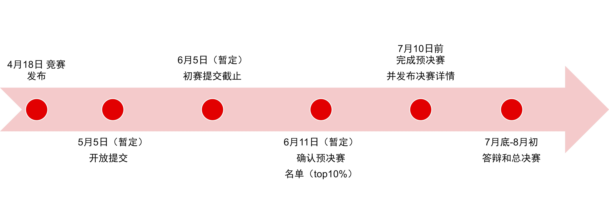

<!--# CCF TCARCH- Customized Computing Challenge!-->

**CCF TCARCH-** 计算机体系结构挑战赛是中国计算机学会体系结构专委会所举办的旨在挖掘计算机体系结构人才、激发学生对计算机体系结构的研究兴趣、培养学生创新精神的一项全国赛事。

Customized Computing Challenge (**CCC** 定制计算算法实现挑战赛)由CCF 体系结构专委主办，北京大学CECA和AMD-Xilinx学术合作部联合承办，北大信息技术高等研究院协办。
是首次发起的基于HLS的算法到硬件实现编程挑战赛，不仅考察编程能力还考察算法硬件实现能力。比赛采用与ACM编程和学生超算比赛类似赛制，题目分基础题和高级题，闯关制积分，循序渐进，每队不超过2人，展示个人同时鼓励合作。

CCC2022决赛将于2022年7月底8月初举办

<!-- 与CCF TCARCH Advanced Parallel Processing Technology   -->
<!-- ([**APPT2021**](https://appt2021.github.io/)) 以及首届 CCF计算机系统大会 ([**CCFSYS2021**](http://ccfsys2021.zhejianglab.com/index.html)) -->

**注：2022年4月18日开放报名和发布**

<a href="http://118.31.189.183:8008/"><strong>点击报名</strong></a>

## CCC定制计算挑战赛

欢迎关注CCC定制挑战赛公众号，获取更多信息

## 竞赛组织

**主办单位**： CCF计算机体系结构专委会

**承办单位**： AMD-Xilinx，北京大学CECA

**协办单位**： 北京大学AIIT，上海科技大学可重构计算实验室，山东大学，江南大学，南昌大学

## 竞赛流程

## 优秀奖项

- 第一名 总分第1名，10,000元（队员）， Alveo加速卡或MPSOC（指导教师*）
- 第二名 总分第2名，5,000元 （队员），Alveo加速卡或MPSOC(指导教师*)
- 第三名 总分第3名，3,000元（队员），Alveo加速卡或MPSOC(指导教师*)
- Graph题冠军，5,000（队员）
- Big Data题冠军，5,000（队员）

*此处指导教师需为学术机构的教师或研究人员, 所有队员和指导教师都将获得中国计算机学会体系结构专委会颁发的证书*

*单项冠军将有AMD-Xilinx研发根据作品性能，代码风格，架构设计等综合评选，非特指性能排名第一*

*队伍可同时获得总分第1名和单项冠军，即队伍最高有机会获得20,000 (10,000+5,000+5,000)*

## 成绩排名

2022年05月05日（暂定）开放设计提交后，此处显示参赛者的实时成绩排名

---------------------------------------

Copyright&copy; 2022 AMD-Xilinx

