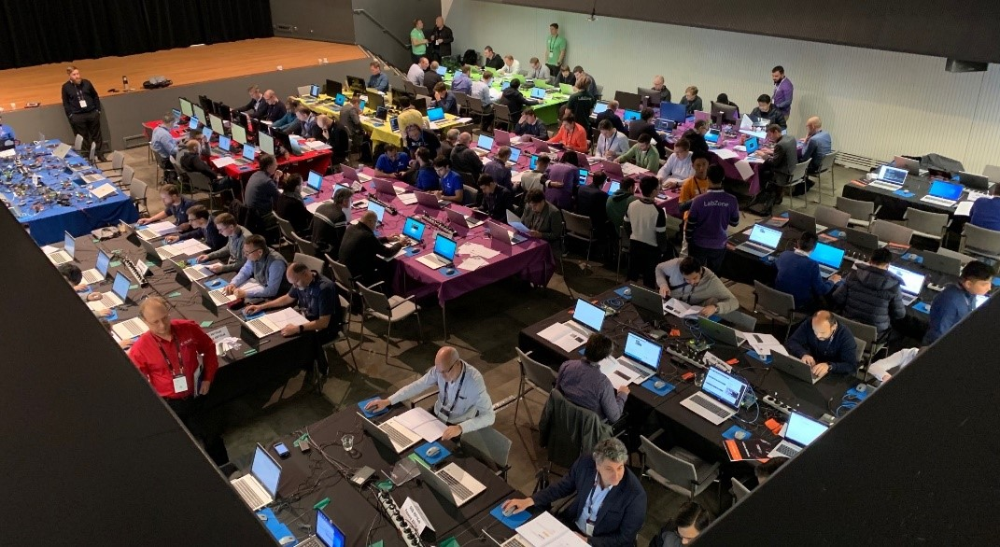

# 竞赛规则

## **1. 报名规则**: 
+ 每队**不超过2人**，可跨单位组建
<a href="https://xupsh.github.io/ccc2021/upload.html"><strong>点击报名</strong></a>
+ 本科生，研究生，已工作不限  
  
## **2.挑战规则**

### 初赛
+ 基础题中DSP 与 CV方向至少各完成一题
+ 高级题中至少完成一题

### 复赛

+ 预决赛将选取成绩排名前10%的队伍（总数不超过20支），并提供硬件设备
+ 复赛高级题中至少完成一题

### 决赛
+ 根据预决赛成绩取排名前3-5名进入现场总决赛（包括题目和答辩）

  

## **3.积分规则**

### 单题积分规则

+ 根据要求选择题目，只取其中最高分的成绩
+ 每题排名第1名积分为100分， 第15名积20分
+ 其余队伍，满足最低性能指标成功提交的积10分

| 名次 | 1 | 2 | 3 | 4 | 5 |6 | 7 | 8 | 9 | 10 | 11 | 12 | 13 | 14 | 15 | 提交 |
|:---:|:--:|:--:|:--:|:--:|:--:|:--:|:--:|:--:|:--:|:--:|:--:|:--:|:--:|:--:|:--:|:--:|
| 积分 | 100 | 90 | 80 | 75 | 70 | 65 | 60 | 55 | 50 | 45 | 40 | 35 | 30 | 25 | 20 | 10 |

### 总积分规则

+ 基础题只取所属方向中最高分的题目， 如CV中3题全完成只取其中排名最高的1题
+ 高级题两个方向得分都计入总分
+ 基础题完成DSP和CV中各一个之外，每多成功提交一个题目，总分增加3%
+ 根据每一道题的不同难度级别，乘以对应的难度系数后计入总分，基础题系数为1.0，高级题系数为1.5

> **例如：**假设你的队伍初赛试题两题都排名第三，高级题最高的排名一个第二，一个第五，此外，你的队伍还多做了一道基础题，那应该计几分呢？
> > 初级题总计得分2\*1.0\*80=160分  
> > 高级题得1.5\*(90+70)=240分  
> >
> > 最后，计算额外成功提交题目的加分，总分应为（160+192）\* 103% = 412分

+ **若发现试图通过多次提交等手段来获取testbench信息的行为，组委会有权取消该题成绩**

## **4. 排名规则**
+ 每题的排名根据性能指标(具体信息请参考每题中的说明)，如果两队性能指标相同，则按提交时间排序，提交时间早的排名在前
+ 队伍总排名为所有题目积分综合
+ 每题的排名和队伍积分自动更新，每一个小时自动更新一次排名，并更新总积分和排名

## **5. 决赛规则**  

比赛得分前三名将进行现场答辩，综合现场答辩和之前总成绩，决出最终一、二、三排名。单项冠军将有AMD-Xilinx研发根据作品性能，代码风格，架构设计等方面进行综合评选，而非特指性能排名第一。

 
