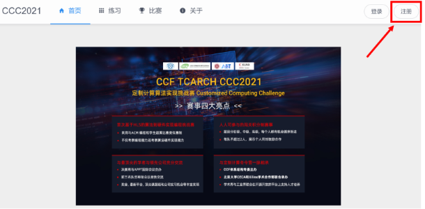
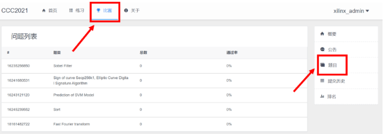

# 作品提交

&nbsp;&nbsp;&nbsp;&nbsp;&nbsp;**2022年5月5日开放注册报名通道**
>请先注册
>
>注: 每队每天每题最多20次提交机会

## 1.报名注册

&nbsp;&nbsp;&nbsp;&nbsp;&nbsp;<a href="http://ccc2021.rieslab.cn:8008/"><strong>点击注册</strong></a>
 
>请点击导航栏右上角注册按钮，如下图所示
>
>
>

>
>
>
>注册注意事项： 
>1.按提示填入各项信息，确保信息无误。 
>2.其中队员2名字、队员2学校/单位以及指导老师为选填项，有则填上信息，无则空着。 
>3.其他选项为必填项。不填页面上会有提示。 
>4.密码长度在6-20之间。 
>5.验证码不区分大小写。 

## 2. 提交作品流程

<!--## 作品提交的入口如下：-->

&nbsp;&nbsp;&nbsp;&nbsp;&nbsp;**2022年5月05日开放作品提交通道**

&nbsp;&nbsp;&nbsp;&nbsp;&nbsp;**2022年6月05日关闭作品提交通道**

>
>
>

>
>
>

>1.点击页面左上方“比赛”按钮，在下方全部比赛中点击“CCC2021-初赛”。 
>2.点击界面左侧“题目”按钮，在题目列表中选择您想提交的题目。 
>3.在题目要求中您可点击链接查看详细题目说明、提交要求等信息，并下载框架代码。 
>4.当您完成设计之后，在页面下方您的解答中点击“上传代码”提交。 

<!--[http://ccc2021.rieslab.cn:8008/](http://ccc2021.rieslab.cn:8008/)-->
