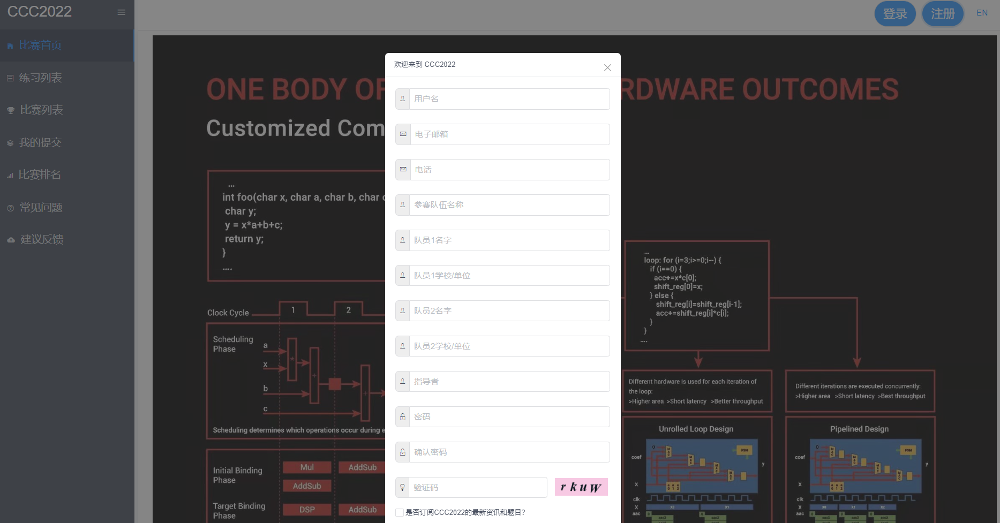
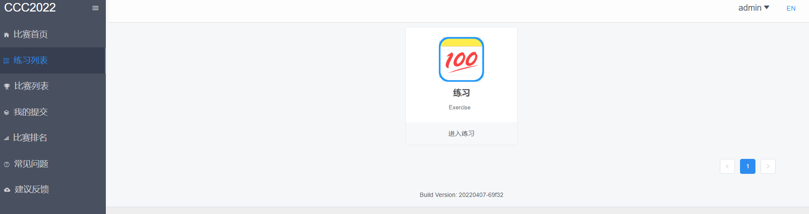
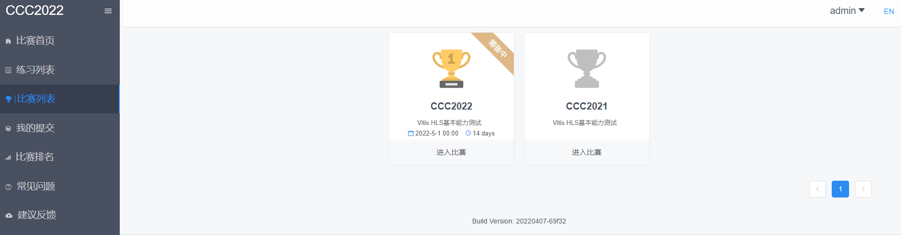
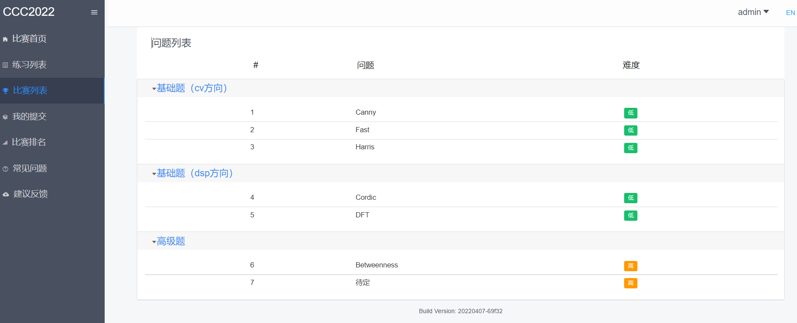
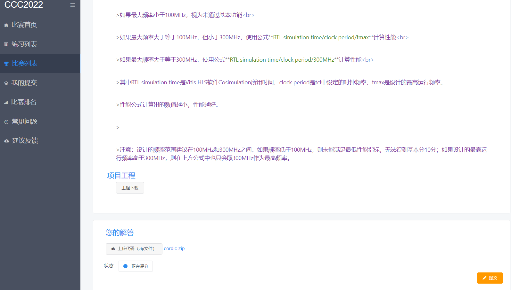
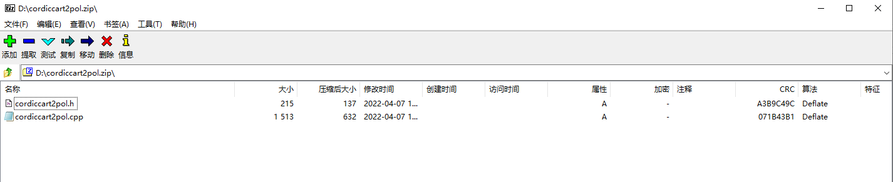
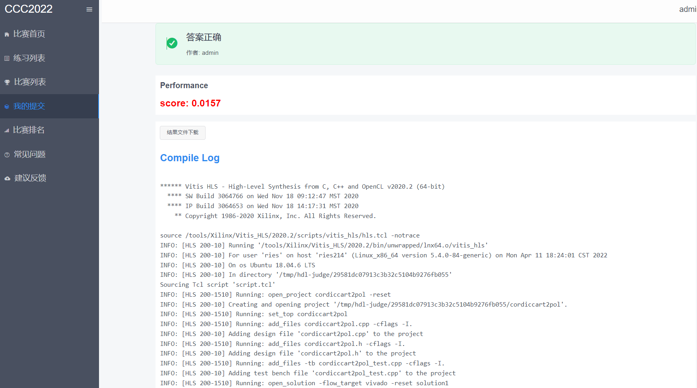
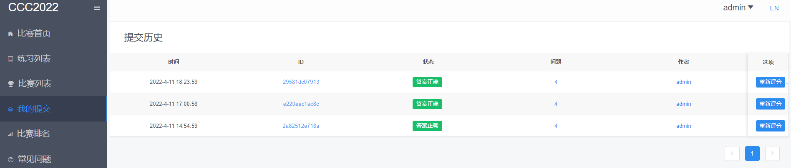
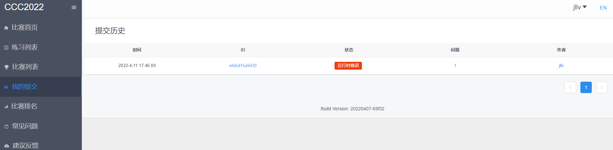

## 引导

打开<a href="http://118.31.189.183:8008/">CCC2022首页</a>，可通过点击页面的Tab（比赛首页、练习列表、比赛列表、我的提交、比赛排名、常见问题、建议反馈）切换页面。

- 比赛首页：CCC2022相关信息介绍
- 练习列表：报名选手通过练习里的问题来熟悉系统使用流程
- 比赛列表：包含CCC2022以及历年的比赛题目
- 我的提交：查看个人提交答案的详情
- 比赛排名：实时显示比赛的总排名情况
- 常见问题：包含常见问题以及一些解答
- 建议反馈：报名选手可以在线反馈遇到的问题或建议

### 用户注册

- 打开首页，点击右上角“注册”，填写必填项：“用户名”、“电子邮箱”、“电话”、参赛队伍名称、“队员1名字”、“队员1学校/单位”、“密码”，非必填项：“队员2名字”、“队员2学校/单位”、“指导者”，并选择是否订阅CCC2022的最新资讯和题目，完成账户注册。点击“登录”，输入用户名、密码，完成登录。

### 练习列表

- 练习列表中，题目根据难度进行分类，有“低”、“中”、“高”三种难度设置，用户可以选择合适的题目进行练习

### 比赛列表

- 点击比赛列表Tab，进入赛事介绍页面，赛事介绍中包括了赛事的开始日期和持续时间，赛事题目会在比赛时间段内开放提交，其他时间段只可浏览题目

- 在赛事页面中点击参加的赛事，点击右侧题目进入比赛试题列表页面,点击试题列表页面中一道题目，进入试题详情页面。基础题是分成两类，每一类只要完成一道即可解锁高级题

- 选手可以下载试题的样例工程作为参考。在试题最下面上传您的解答代码，然后点击右下角提交按钮，在页面左下角会显示提交状态。每队每天每题最多20次提交机会

- 提交的答案为zip压缩包格式，其他格式提交的答案无效。注意请不要提交与题目无关的文件，并且文件不要包含新的路径，需与项目工程一致

- 可点击提交状态进入提交详情页面查看编译日志和结果文件

- 题目页面右侧可以查看提交历史和每题排名

### 我的提交

- 我的提交中显示选手所有提交的提交历史

