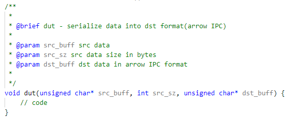

  >
  >## •Serialization
  >
  >  1）	框架代码说明
  >
  >  >框架代码是算法的C-model，您需要自行设计可综合co-sim的设计。  
  >  >但请注意：**您必须保持顶层函数不变。**
  >
  >  2）项目要求  
  >
  >
  >
  >  >
  > 
  > 3）提交程序
  > 
  >  >您仅需提交cpp文件和h文件。请将除test.cpp以外的所有cpp和h文件压缩为一个压缩包canny.zip，在页面下方您的解答处点击“上传代码”按钮进行提交，稍待片刻即可在文本框下方得知您的设计是否通过了基本功能测试。延迟、面积等性能指标则可在历史提交记录中点击版本号详细查看。
  > 
  > 4）评分规则
  > 
  >  >•正确序列化fix_size数据类型的输入，如int32，记1分；
  > >
  >   >•正确序列化variable_size数据类型的输入，如string，记1分；
  > >
  >  >•正确序列化fix/variable_size混合数据类型的输入， 记1分；
  > >
  >   >•记录运行各类型输入的时间 t_fix，t_var，t_mix；
  > >
  >  >•mark = 1/t_fix + 1/t_var + 1/t_mix。
